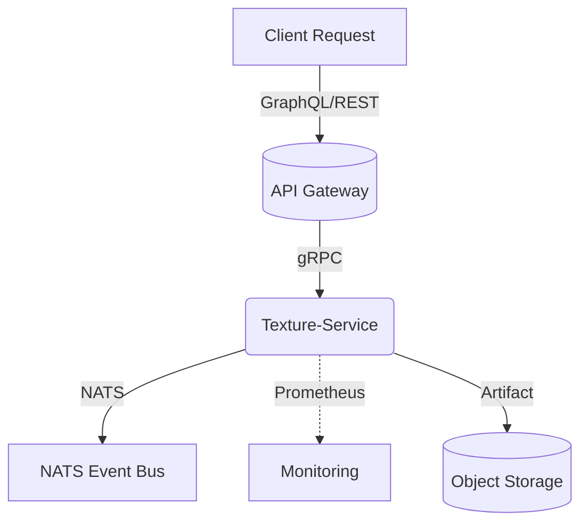

```markdown
# SynestheticCanvas — Texture Service  
> Dynamic, procedural texture synthesis for real-time, multi-modal artworks.

```
╭─────────────────────────────────────────────────────────────────────────────╮
│  ███████╗██╗   ██╗███╗   ██╗████████╗███████╗████████╗███████╗ ██████╗      │
│  ██╔════╝██║   ██║████╗  ██║╚══██╔══╝██╔════╝╚══██╔══╝██╔════╝██╔═══██╗     │
│  ███████╗██║   ██║██╔██╗ ██║   ██║   █████╗     ██║   █████╗  ██║   ██║     │
│  ╚════██║██║   ██║██║╚██╗██║   ██║   ██╔══╝     ██║   ██╔══╝  ██║   ██║     │
│  ███████║╚██████╔╝██║ ╚████║   ██║   ███████╗   ██║   ███████╗╚██████╔╝     │
│  ╚══════╝ ╚═════╝ ╚═╝  ╚═══╝   ╚═╝   ╚══════╝   ╚═╝   ╚══════╝ ╚═════╝      │
╰─────────────────────────────────────────────────────────────────────────────╯
```

---

## Table of Contents
1. Motivation & Responsibilities  
2. Architecture & Flow  
3. Build / Run / Deploy  
4. Configuration & Environment  
5. GraphQL & REST contract  
6. C Code Quick-Start  
7. Observability (Logging / Metrics / Tracing)  
8. Error Codes & Troubleshooting  
9. Security Considerations  
10. Contributing & Code Style  

---

## 1. Motivation & Responsibilities
The **Texture Service** is a standalone microservice responsible for **on-the-fly procedural texture generation** and **version-safe texture storage**.  
It exposes:

* GraphQL field  `texture(...)`  for dynamic synthesis.  
* REST endpoint  `POST /v1/textures/synthesize`  as a fallback.  
* Asynchronous event stream `texture.generated` via NATS for downstream consumers (e.g. animation-service).  

Key features
* Deterministic seed-based noise functions (Perlin, Simplex, Worley).  
* High-resolution tile-aware generation (power-of-two MIP pyramid).  
* Built-in LRU cache with configurable memory budget.  
* SIMD-accelerated RGBA pipeline (AVX2 / NEON).  
* Metrics, tracing, and audit-grade request logging.  

---

## 2. Architecture & Flow


Design patterns employed:

* **Service Layer** — `tx_service.c` (transport-agnostic business logic)  
* **Repository Pattern** — `repository/s3_repository.c` or `repository/fs_repository.c`  
* **Command / Query Separation** — Commands mutate artefacts; queries never do.  
* **Factory** — `noise_factory.c` dynamically picks SIMD/non-SIMD implementations.  

---

## 3. Build / Run / Deploy

### Prerequisites
* GCC 11+ / Clang 14+ with `-std=c17` support  
* CMake 3.20+  
* vcpkg (optional) for third-party deps  
* Protocol Buffers 3.21 (only for gRPC contracts)  

### Build
```bash
git clone https://github.com/synesthetic-canvas/api_graphql.git
cd api_graphql/services/texture-service
mkdir build && cd build
cmake -DCMAKE_BUILD_TYPE=Release ..
make -j$(nproc)
```

### Run Locally
```bash
export TX_CFG=../config/local.toml     # or use /etc/syn_canvas/texture.toml
./texture-service --config "$TX_CFG"
```

### Docker
```bash
docker build -t syn_canvas/texture-service:latest .
docker run --rm -p 8082:8082 -e TX_ENV=production syn_canvas/texture-service:latest
```

---

## 4. Configuration & Environment

| Variable              | Default        | Description                                       |
|-----------------------|----------------|---------------------------------------------------|
| `TX_ENV`              | `development`  | Service mode (`development`, `staging`, `prod`)   |
| `TX_PORT`             | `8082`         | HTTP listener port                                |
| `TX_CACHE_MB`         | `512`          | In-memory RGBA cache size (MiB)                   |
| `TX_SIMD`             | `auto`         | `on`, `off`, or `auto` (CPU feature detect)       |
| `TX_LOG_LEVEL`        | `info`         | `trace` .. `fatal`                                |
| `TX_S3_ENDPOINT`      | —              | Custom S3 endpoint (minio, ceph, etc.)            |
| `TX_JWT_PUBLIC_KEY`   | —              | Path/URL to PEM for request validation            |

Configuration file example (`config/prod.toml`):
```toml
[server]
port       = 8082
workers    = 4

[cache]
memory_mb  = 1024
ttl_sec    = 600

[s3]
bucket     = "syn_canvas_textures"
endpoint   = "https://s3.art-net.cloud"
region     = "us-east-1"

[security]
jwt_public_key = "/etc/keys/jwt_pub.pem"
```

---

## 5. GraphQL & REST Contract

### GraphQL SDL excerpt
```graphql
"""
Procedurally generated texture
"""
type Texture {
  id: ID!
  format: ImageFormat!
  resolution: Resolution!
  createdAt: DateTime!
  url: URL!
}

extend type Query {
  """
  Generate or retrieve a procedural texture
  """
  texture(
    seed:           String!,
    algorithm:      TextureAlgorithm! = SIMPLEX,
    width:          Int! = 1024,
    height:         Int! = 1024,
    paletteKey:     String
  ): Texture! @rateLimit(window: "5s", max: 10)
}
```

### REST fallback
```
POST /v1/textures/synthesize HTTP/1.1
Content-Type: application/json

{
  "seed": "midnight-aurora-42",
  "algorithm": "PERLIN",
  "width": 2048,
  "height": 2048,
  "palette_key": "deep_night"
}
```

Success → `201 Created`  
Failure → `400`, `401`, `429`, `500`  

---

## 6. C Code Quick-Start

Below is an ultra-concise example of embedding the **Texture Service** core in a custom executable.
```c
/**
 * demo_app.c — minimal texture generation demo
 */
#include <stdio.h>
#include <stdlib.h>
#include "tx_service.h"

int main(int argc, char **argv)
{
    (void)argc; (void)argv;

    tx_service_cfg cfg = tx_service_cfg_default();
    cfg.cache_mb   = 128;
    cfg.log_level  = TX_LOG_DEBUG;

    tx_service_t *svc = tx_service_start(&cfg);
    if (!svc) {
        fprintf(stderr, "Failed to start texture service\n");
        return EXIT_FAILURE;
    }

    tx_request_t req = {
        .seed      = "sunset-haze-17",
        .algo      = TX_ALGO_SIMPLEX,
        .width     = 512,
        .height    = 512,
        .palette   = "warm_vibes"
    };

    tx_result_t res = {0};
    tx_status_t st  = tx_service_generate(svc, &req, &res);

    if (st == TX_OK) {
        printf("🎨 Texture generated at: %s\n", res.url);
    } else {
        printf("⚠️  Generation failed: %s\n", tx_status_str(st));
    }

    tx_service_stop(svc);
    return EXIT_SUCCESS;
}
```

Build:
```bash
gcc -std=c17 -Iinclude demo_app.c -L./build -ltexture_service -o demo_app
```

---

## 7. Observability

* **Metrics** — Prometheus exposition on `/metrics` (latency, cache hit ratio, texture_size_bytes).  
* **Logging** — Structured JSON (serilog-compatible).  
* **Tracing** — OpenTelemetry exporter (`OTEL_EXPORTER_OTLP_ENDPOINT`).  

Example Grafana panel:
```
avg(rate(texture_generation_seconds_sum[5m])) by (algorithm)
```

---

## 8. Error Codes & Troubleshooting

| Code | Symbol             | Explanation                          | Remediation                    |
|------|--------------------|--------------------------------------|--------------------------------|
| 400  | `TX_E_BAD_REQ`     | Invalid payload or parameter range   | Validate inputs                |
| 401  | `TX_E_UNAUTHORIZED`| JWT missing / invalid                | Provide valid token            |
| 404  | `TX_E_NOT_FOUND`   | Texture ID does not exist            | Ensure correct seed            |
| 409  | `TX_E_CONFLICT`    | Duplicate generation in progress     | Retry w/ backoff               |
| 429  | `TX_E_RATE_LIMIT`  | Too many requests                    | Slow down / upgrade plan       |
| 500  | `TX_E_INTERNAL`    | Unhandled server error               | Check logs / file bug report   |

To enable **verbose debug**:
```bash
export TX_LOG_LEVEL=debug
```

---

## 9. Security Considerations
* All network traffic encrypted via **mTLS** (HAProxy terminator).  
* **JWT + PASETO** support for flexible auth scenarios.  
* Optional **WAF** integration (modsecurity, AWS WAF) protecting `/v1/*`.  
* Resource quotas guard against GPU/CPU exhaustion attacks.  

---

## 10. Contributing & Code Style
* Follow the **LLVM coding standard** (`clang-format -style=file`).  
* One feature per branch → Pull Request → review by ≥2 maintainers.  
* Unit tests **mandatory** (`ctest --output-on-failure`).  
* Submit Doxygen comments for every new public function.  

Happy hacking 💜🖌️  
*— SynestheticCanvas Core Team*
```