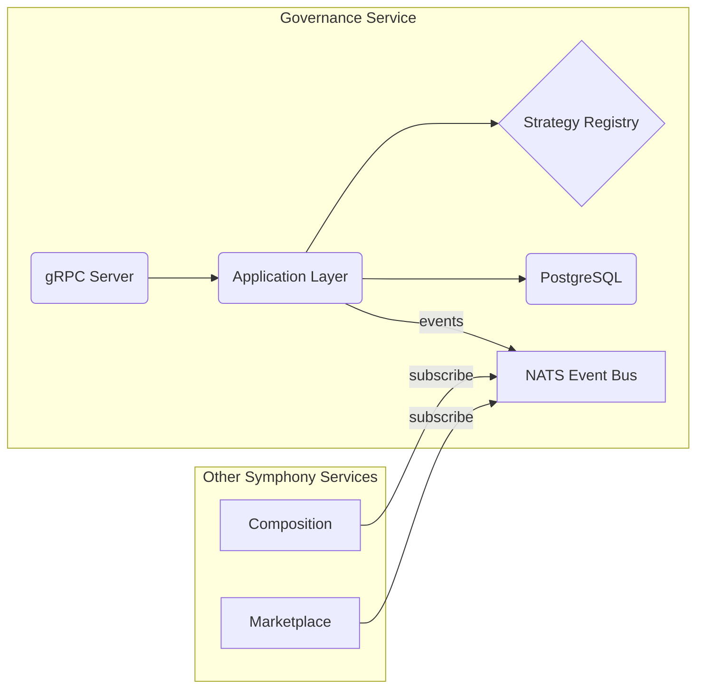

```markdown
# 🎼 CanvasChain Symphony – Governance Service

The Governance Service is a **stand-alone, event-driven microservice** responsible for proposal lifecycle management, on-chain DAO voting, and parameter upgrades in **CanvasChain Symphony**.  
Written entirely in **Rust**, it exposes a **gRPC** API, emits domain events through **NATS**, and persists state in **PostgreSQL** via **`sqlx`**.

---

## ✨ Key Responsibilities

1. **Proposal Management**  
   • Create, update, cancel, queue, and execute proposals (smart-contract upgrades, fee changes, feature toggles).  
2. **Vote Accounting**  
   • Off-chain vote aggregation with **Merkle proofs** for on-chain batching.  
3. **Quorum & Threshold Enforcement**  
   • Pluggable strategies (simple majority, quadratic voting, conviction voting).  
4. **Timelock Orchestration**  
   • Time-buffered execution to mitigate governance attacks.  
5. **Cross-Service Event Propagation**  
   • Publishes `GovernanceEvent`s (`ProposalCreated`, `VoteCast`, …) to the Symphony event bus.

---

## 🚀 Quick Start

```bash
# Launch with default config
cargo run -p governance_service
```

```bash
# Run the gRPC health-check
grpcurl -plaintext localhost:50052 grpc.health.v1.Health/Check
```

---

## 🛰️ Service Architecture



---

## 📦 Public gRPC API (excerpt)

```protobuf
syntax = "proto3";

package canvaschain.governance.v1;

service GovernanceService {
    rpc SubmitProposal(SubmitProposalRequest) returns (SubmitProposalResponse);
    rpc CastVote(CastVoteRequest) returns (CastVoteResponse);
    rpc QueryProposal(QueryProposalRequest) returns (QueryProposalResponse);
}

message SubmitProposalRequest {
    string proposer = 1;
    string title    = 2;
    string summary  = 3;
    bytes  payload  = 4; // Encoded smart-contract call
}

message SubmitProposalResponse {
    uint64 proposal_id = 1;
}

message CastVoteRequest {
    uint64 proposal_id = 1;
    string voter       = 2;
    VoteOption option  = 3;
}

enum VoteOption {
    VOTE_OPTION_UNSPECIFIED = 0;
    VOTE_OPTION_YES         = 1;
    VOTE_OPTION_NO          = 2;
    VOTE_OPTION_ABSTAIN     = 3;
}
```

---

## 🦀 Rust Usage Example

```rust
use governance_sdk::{
    client::GovernanceClient,
    types::{SubmitProposalRequest, CastVoteRequest, VoteOption},
};

#[tokio::main]
async fn main() -> anyhow::Result<()> {
    // Connect to the running governance node
    let mut client = GovernanceClient::connect("http://localhost:50052").await?;

    // 1️⃣  Submit a proposal
    let proposal_id = client
        .submit_proposal(SubmitProposalRequest {
            proposer: "0xA1CE…".into(),
            title:    "Enable quadratic voting".into(),
            summary:  "Switch the vote weight function to sqrt(stake).".into(),
            payload:  vec![], // ABI-encoded call
        })
        .await?
        .proposal_id;

    // 2️⃣  Cast a vote
    client
        .cast_vote(CastVoteRequest {
            proposal_id,
            voter: "0xBEEF…".into(),
            option: VoteOption::Yes,
        })
        .await?;

    println!("Vote submitted!");
    Ok(())
}
```

---

## 🛠️ Extensibility – Strategy Pattern

```rust
/// Trait every vote-weight strategy must implement.
pub trait VoteWeightStrategy: Send + Sync {
    fn weight_for(&self, staked_tokens: u128) -> f64;
}

/// Linear ⬆️
pub struct LinearWeight;
impl VoteWeightStrategy for LinearWeight {
    fn weight_for(&self, staked_tokens: u128) -> f64 {
        staked_tokens as f64
    }
}

/// Quadratic ➗➗
pub struct QuadraticWeight;
impl VoteWeightStrategy for QuadraticWeight {
    fn weight_for(&self, staked_tokens: u128) -> f64 {
        (staked_tokens as f64).sqrt()
    }
}
```

Swap strategies at runtime via a `--vote-weight-strategy` CLI flag or configuration YAML.

---

## 🧪 Running Tests

```bash
# Unit + integration tests
cargo test -p governance_service
```

Coverage badge (grcov + GitHub Actions):  


---

## 📄 Environment Variables

| Variable                 | Default     | Description                                |
|--------------------------|-------------|--------------------------------------------|
| `GOVERNANCE__DB_URL`     | postgres:// | PostgreSQL connection string               |
| `GOVERNANCE__NATS_URL`   | nats://127.0.0.1:4222 | NATS server URI               |
| `GOVERNANCE__RPC_PORT`   | 50052       | gRPC listening port                        |
| `RUST_LOG`               | info        | Log level (`error`, `warn`, `info`, …)     |

---

## 📘 Further Reading

1. [CanvasChain Whitepaper](../docs/whitepaper.pdf)  
2. ADR-007 – Governance Quorum & Threshold Derivation  
3. ADR-014 – Timelock Executor Design  

---

© 2024 CanvasChain Contributors – MIT / Apache-2.0 dual-licensed.
```